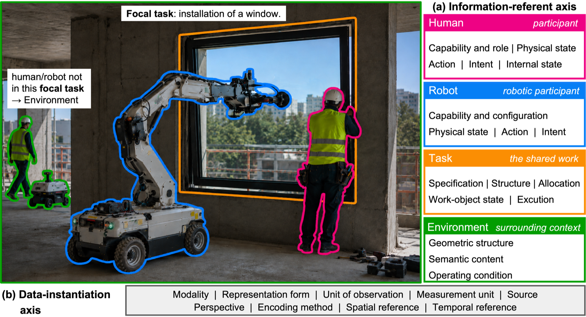

# Construction Human–Robot Collaboration

Public, machine-readable assets accompanying the manuscript:

> **A Data-Centric Perspective on Construction Human–Robot Collaboration: Taxonomy, Landscape, and Infrastructure**

*The H/R/T/E taxonomy at the core of this work: it classifies the Human, Robot, Task, and Environment information a CHRC data resource should represent, together with nine data-instantiation properties.*

## Contents

| Directory | What it holds |
|-----------|---------------|
| `vocab/` | The CHRC vocabulary (`chrc.ttl`) and the JSON-LD `@context` (`context.jsonld`). |
| `schemas/` | `resource-profile.schema.json` (JSON Schema for the resource profile) and `episode-graph.shacl.ttl` (SHACL shapes for the collaborative-episode graph). |
| `examples/` | Worked examples: a resource profile (JSON-LD) and a collaborative-episode graph (RDF/Turtle) for four published resources. |
| `review/` | The systematic-review coding data: codebook, per-resource coding table, and the PRISMA exclusion list. |

## Namespace

- Vocabulary IRI prefix: `https://hzhengrd.github.io/CHRC/vocab/chrc#`
  - Example: `chrc:Human` = `https://hzhengrd.github.io/CHRC/vocab/chrc#Human`
- Example instance namespace: `https://hzhengrd.github.io/CHRC/examples/<resource>/`

## Status

These files are **reference implementations** accompanying the manuscript. They are offered as guidance for a future implementation, not as a finished production system.

## License

Unless otherwise noted, the assets in this repository are released under the [Creative Commons Attribution 4.0 International (CC-BY-4.0)](https://creativecommons.org/licenses/by/4.0/) license. The persistent, citable version of this repository is the Zenodo record (DOI: [10.5281/zenodo.22125779](https://doi.org/10.5281/zenodo.22125779)).

## Citation

Cite as: *TBD (placeholder — final citation to be added once the Zenodo record title is confirmed)* — DOI: [10.5281/zenodo.22125779](https://doi.org/10.5281/zenodo.22125779).
